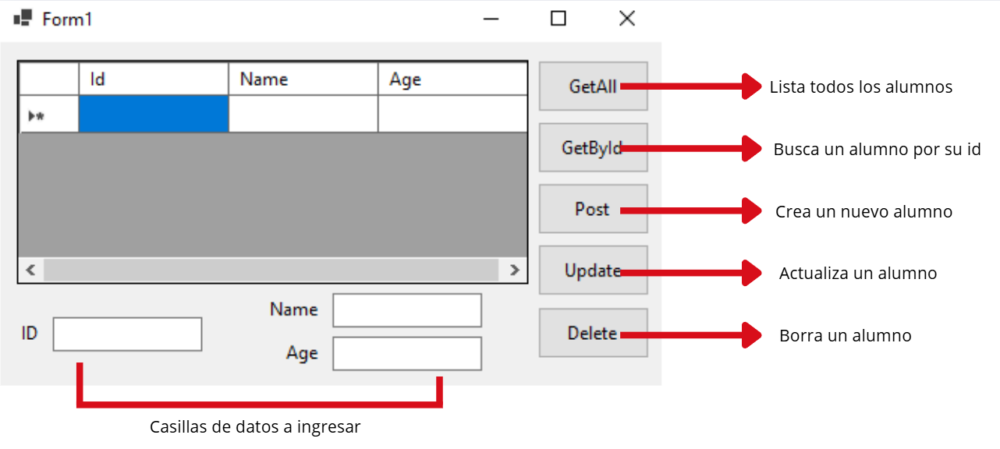

# 📌 Proyecto ASP.NET MVC + EF Core + Windows Forms

Este proyecto consiste en una **API REST** desarrollada con **ASP.NET MVC** y **Entity Framework Core**, utilizando **PostgreSQL** como base de datos.  
La API es consumida desde una aplicación de **Windows Forms (WinForms)**.

## 🚀 Tecnologías utilizadas
- [ASP.NET MVC](https://dotnet.microsoft.com/apps/aspnet) - Framework para construir la API.
- [Entity Framework Core](https://learn.microsoft.com/ef/core) - ORM para el acceso a la base de datos.
- [PostgreSQL](https://www.postgresql.org/) - Base de datos relacional.
- [Windows Forms](https://learn.microsoft.com/dotnet/desktop/winforms/) - Cliente de escritorio para consumir la API.

## 📂 Estructura del proyecto
Proyecto/
│── Api/ # Proyecto ASP.NET MVC con EF Core (endpoints REST)
│── ClienteWinForms/ # Proyecto WinForms que consume la API
│── README.md # Documentación del proyecto

## ⚙️ Funcionalidades
- CRUD completo (Create, Read, Update, Delete) sobre la entidad **Alumno** (ejemplo).
- Validaciones desde la API.
- Consumo de la API desde una interfaz de escritorio en **WinForms**.

## ▶️ Ejecución del proyecto
1. Clonar el repositorio:
   ```bash
   git clone https://github.com/usuario/proyecto.git
2. Configurar la cadena de conexión en appsettings.json del proyecto Api (PostgreSQL).
"ConnectionStrings": {
  "DefaultConnection": "Host=localhost;Port=5432;Database=NombreBD;Username=usuario;Password=clave"
}
3. Aplicar migraciones de EF Core:
dotnet ef database update
4. Ejecutar la API:
dotnet run --project Api
5. Ejecutar el Cliente WinForms y la WebRestApp para probar el consumo de la API.

## 📸 Captura

